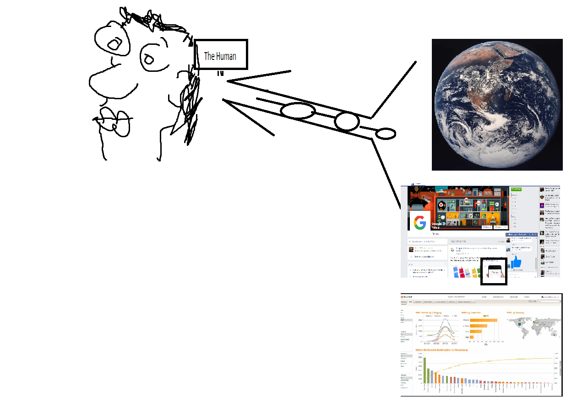

How is one meant to reflect on the actions of our past? Is it beneifical to our future if we do not get caught up in the events of our yesteryears? If we focus our time on tomorrow are we more likely to survive? 

Is it possible to keep track of our existence in one beautifully 'indexed' snap shot instead of using the archaic human invention of [Human Time](#Human-time).

- an indexer has been a good solution, but it's value is struggling to out weigh the benefits of having the interest of it's success invested in individual-humans.
the answer lies in the connection being built 'between individual-humans', and not 'between individual humans and their artificial intelligence'. #humanmasterrace
