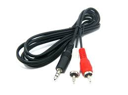
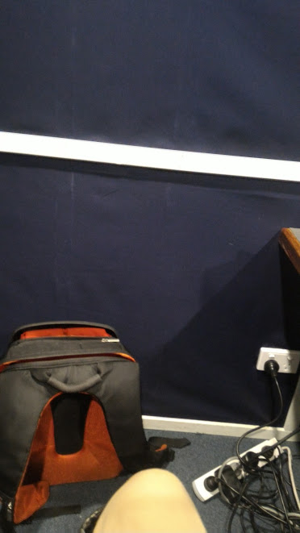
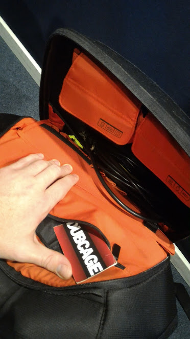
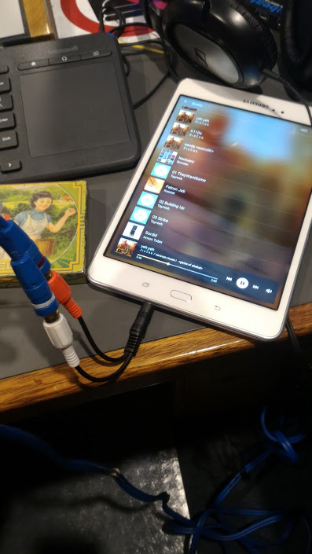
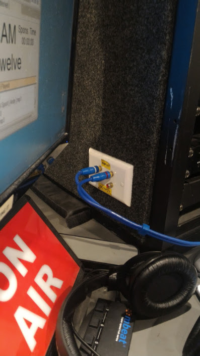

---
layout:post
published: true
title: cableguy
---
## No Aux Cable? (not what you are thinking)
 
it's not until the scotsman says that you're the guy that has a cable for everything that you reflect back on your ocd-like fetishes for 'having a cable for everything?' We shouldn't have to compete our own inventions in order to have a cable for everything, so let's hurry up and make that a thing. put me out of a 'that local guy' opportunity with a one-size-fits-all solution. Imagine a world when you don't have to worry about grabbing a cable, you'd just use the same one for literally everything... Oh wait it's already here. Wireless is where all the forward thinking should be. Already Wirelress internet has its sites(sights) on the [extreme](http://www.gizmodo.com.au/2015/09/telstras-new-4gx-device-will-see-you-browsing-at-up-to-600mbps/)...
 

...and this guy had no problems surpassing the upper extremes of possibly an entire neighborhoods whole internet usage in one day. [okay, possibly not.](http://www.smh.com.au/digital-life/digital-life-news/guzzling-data-australian-internet-downloads-explode-20150401-1mcqgq.html) but it's still an amazingly viable solution to delivering the internet that I see no point continuing investment on fixed line networking. You don't need [FTTP](http://blog.jxeeno.com/fttp-rollout-comes-to-an-end/), get over it. Have you seen what you can do with wireless? [1.59Gbit/s - 5G](http://phys.org/news/2016-03-world-5g-wireless-spectrum-efficiency.html).
 
*-and why does it need to be called anything apart from just 'wireless'?*
 
 

 
Being declared the cable guy has encouraged me to [reflect on times once past](http://jakesbits.tictail.com/) and I've come to realise that I really am your main man to deliver some hot #cablegame.
 

 
What is an aux cable anyway? I'll tell ya what it is - it's a dirty excuse for not coming up with a cooperative standard: 3.5mm single-port jack on one side, and two seperate RCA channels for L and R on the other. Why couldn't we build a [standard](https://en.wikipedia.org/wiki/Standard) cable that has a scope beyond one or two products? and for google sakes be the same on each end, [without it being an outright scam](http://www.apple.com/au/shop/product/MD861ZM/A/apple-thunderbolt-cable-2m-white). This is where credibility comes from. Why does open-source need to be so hard?
 
 -#auxcable
 

here's

me

nailing

it.
 
Nailed it. there's just something beautiful and endearing about being the guy you can trust to get the job done.
 
## are we in control?
on point: https://www.youtube.com/embed/7Pq-S557XQU Are we losing sight(site) of the primary focus of technology? Should technology be serving you, instead of the other way around? Do we need to look forward in to the future of #humanity and lay the ground rules now to avoid being eraddicated as a race in 20,000 years? Is it laughable to think that the inhabitants of the universe would even use time references such as Year:20,000 structure?

Enough curveball topics for one night, I'll leave you with this.
What if we were to pull out and reassign all internet infrastructure focus to be on the future of wireless being THE universal standard. That is, it's not just about leaving one or two major cooperations to monopolize the technology for a telecommunications platform, we must use the technology in a way that links everything together is an absolutely harmonic environment. Think of proper future social platforms like VR environment streaming, it's not until we ask ourselves of these fantastys, that we [realise](http://www.internetlivestats.com/internet-users/) we're already on an out of control spiral with no direction. 
 
 I smell the need to have future rants about things such as wealth distribution and really explore some VR possibiltiies. REAL soon. RemindMe!  (haha wishful thinking, yo reddit!)
 
Anyway,
human:jake signing off.
